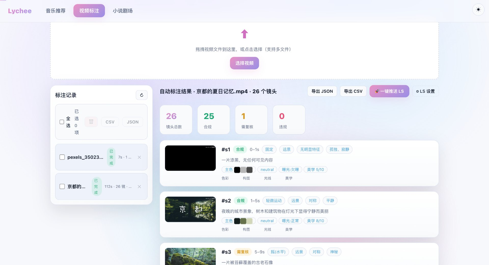
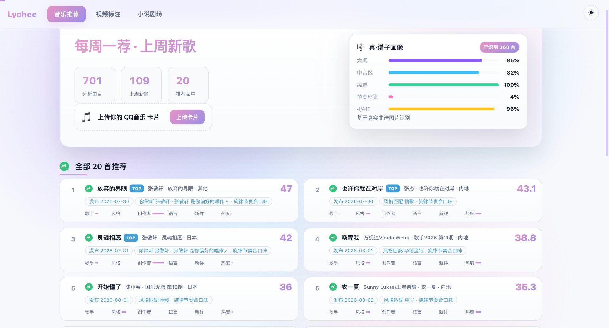
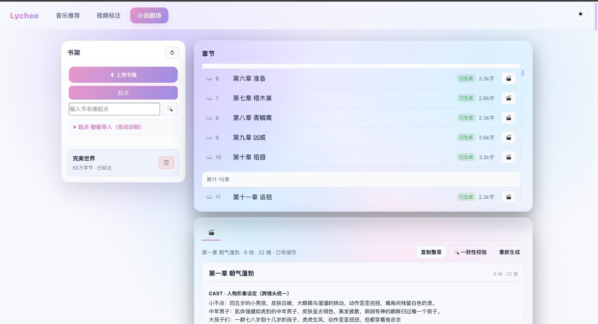
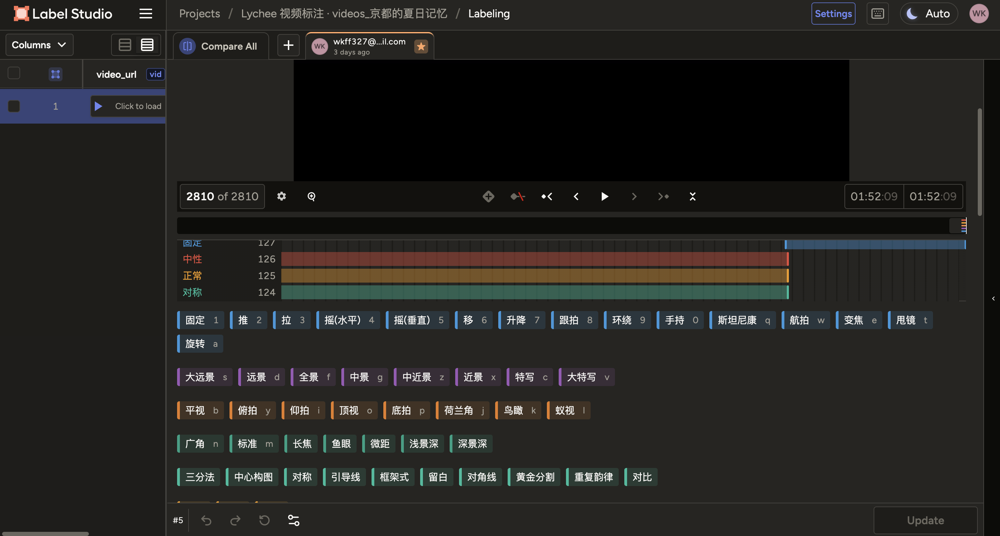
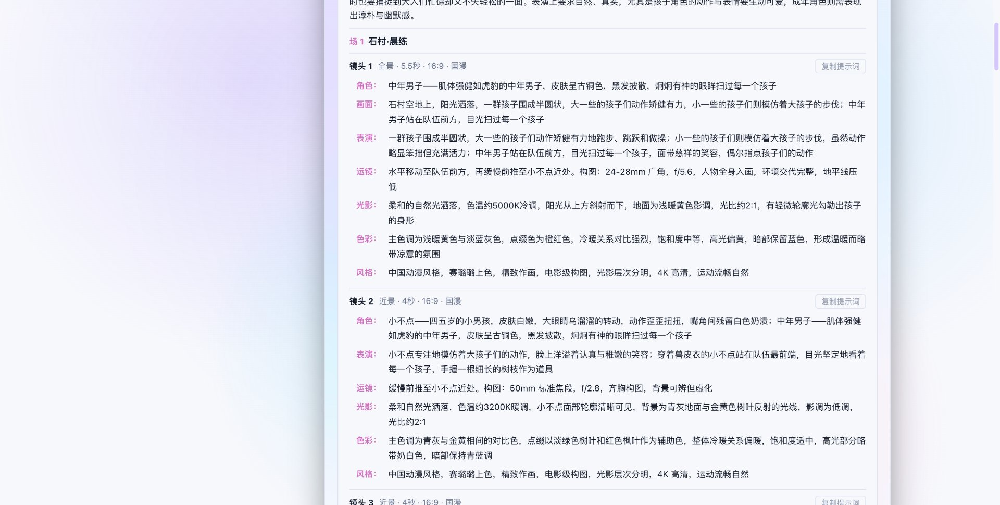

# Lychee


Lychee 是一个面向个人创作的多模态工作台。它把三类素材——视频、音乐、小说——通过确定性的本地流水线，转成可以直接用于二次创作的资产：训练数据、推荐歌单、导演级分镜剧本。

整个系统不依赖任何云端大模型。所有重的计算都跑在本地 Ollama 小模型（qwen2.5:3b 负责文本，qwen2.5vl:3b 负责读图）上，在一台 8GB 内存的 Mac 上即可完整运行。设计上的核心取舍是：**工具必须是确定的、可审计的**（OpenCV、规则引擎、推荐算法），模型只做编排与理解，而不是自由发挥。这样产出的数据质量可控、可复现，也更符合"数据运营"岗位对数据资产的诉求。

## 能力总览

**视频：自动美学与导演级标注**

上传一段视频，系统自动完成镜头切分，并对每个镜头做多维度分析：色彩与光线（OpenCV 计算，无需模型）、运镜（光流估计）、以及由本地视觉模型给出的导演级理解（画面内容、景别、构图、情绪、美学评分）。结果可导出为 JSON / CSV，或一键推送到 Label Studio 做人工复核，服务于训练数据沉淀。



*截图说明：上传视频后自动完成镜头切分（26 个镜头 / 2 分 52 秒），每个镜头单独成卡，顶部实时统计合规 / 需复核 / 违规数量；右侧可一键导出 JSON / CSV 或推送到 Label Studio。*

**音乐：从听歌记录到每周歌单**

导入你的听歌记录后，系统建立口味画像（曲风、情绪、旋律、填词人、热度多维分布），每周产出一份贴合你口味的新歌单。支持多用户：访客在网页上传 QQ音乐「我喜欢的音乐」分享卡片的截图，系统识别其中二维码、跟随短链拉取歌单、建立独立画像，每位用户按自己的口味得到推荐。



*截图说明：左侧 701 首分析曲目、上周 109 首新歌、推荐命中 20 首；右上是「真·谱子画像」——基于本地 VLM 真实读取 QQ 音乐曲谱图，识别 368 首（调式 85% 大调 / 中音区 82% / 级进 100% / 节奏密集 4% / 4/4 拍 96%）；下方为本周匹配度从高到低的 20 首推荐，含歌手/风格/创作者/语言/新鲜度/热度六维分解与可解释理由。*

**小说：通往国漫动画化的导演剧本**

从起点源或本地文本导入小说章节，系统按"场"自动拆解，逐镜生成一镜一条的完整提示词（角色外貌、画面、运镜、光影、色彩、风格），台词 100% 来自原文抽取而非模型创作。另有一致性守门：每章生成后自动校验角色外貌是否仍锁定在角色圣经、是否带国漫/赛璐璐风格尾巴，给出综合分与达标判定。



*截图说明：左侧书架展示已入库小说（如《完美世界》92 万字 · 已标注），智能识别书名起点后自动拉章节；右侧章节列表显示生成状态（已生成 / 字数 / 重生入口），下方是单章的 CAST 角色形象设定锁定区（跨章人物长相锁定 + 国漫/赛璐璐风格锁）。*

## 架构

后端是 FastAPI 服务，前端是单页应用（原生 JavaScript，无构建依赖）。二者之间有一层安全层：API Key 鉴权、按 IP 的滑动窗口限流、严格的内容安全响应头，以及对文件名、视频 id、外链做白名单校验（防路径穿越与 SSRF）。

重分析任务一律提交到后台单工作线程执行，避免本地小机器在并发下 OOM。分析报告落盘到 `output/reports/`，服务重启不丢失，重复分析自动命中缓存。

```
lychee/
├── run.py                      # CLI 入口（视频流水线 / 自然语言能力）
├── requirements.txt
├── src/
│   ├── schemas.py              # 统一数据模型（pydantic v2：VideoReport / Shot / Song …）
│   ├── api/                    # FastAPI 服务：config / security / tasks / server / routers
│   │   ├── routers/            # video · music · novel · label_studio · agent · system
│   │   └── security.py         # API Key(hmac 恒定时间比较) / 限流 / 防穿越·SSRF 白名单
│   ├── video/                  # 镜头切分 · 色彩 · 运镜 · VLM 理解 · RLHF 打分 · 合规闸门 · 导出
│   ├── music/                  # 口味模型 · 多用户入职(QR) · 四维加权推荐 · 平台适配
│   ├── novel/                  # 起点解析 · 分镜生成 · 角色圣经 · 跨章连续性 · 一致性守门
│   ├── agent/                  # 自然语言编排（后端保留；前端助手入口已移除）
│   └── label_studio/           # Label Studio 推送客户端
├── data/                       # 音乐库 / 小说缓存 / 原始视频（内容按 .gitignore 不入库）
├── scripts/                    # start.sh / stop.sh / build_static.py / import_qqmusic_playlist.py
├── web/                        # 单页前端（原生 JS，按 util→theme→api→route→各模块 加载）
├── output/                     # reports / annotations / frames / dist（构建产物）
└── docs/                       # 评估标准与标注规范
```

## 快速开始

### 环境

```bash
conda activate ai            # 项目约定的 Python 环境（3.11）
pip install -r requirements.txt
```

本地还需要 Ollama 与两个模型：

```bash
ollama pull qwen2.5:3b
ollama pull qwen2.5vl:3b
```

### 启动

```bash
scripts/start.sh          # 看门狗启动：检查 Ollama/VLM，崩溃自动重启
scripts/stop.sh           # 停止（含看门狗）
```

启动后终端会打印一条带密钥的访问链接，形如 `http://127.0.0.1:8000/?key=XXXX`。浏览器打开即可。默认只监听 `127.0.0.1`，局域网不可达；所有 `/api/*` 都需要 API Key。

### 三个工作台

- **视频**：左侧视频库选择文件 →「分析」（含视觉模型画面理解）或「快速」（跳过模型）。每个镜头一张卡片：关键帧、画面内容、运镜、色彩/光线、数据价值（清晰度/分辨率/pHash）。标注结果可在报告页导出 JSON / CSV，或推送到 Label Studio。
- **音乐**：展示你的口味画像（曲风/情绪/旋律/填词人多维分布）、本周新歌推荐、已导入的歌单；新用户上传 QQ音乐「我喜欢」分享卡片截图即可入职。
- **小说**：粘贴章节文本或上传文件 → 生成导演级分镜剧本；可对单章做一致性校验。

## 视频标注管线

一条视频经过以下阶段产出报告：

1. **镜头切分**：基于 HSV 直方图帧差检测镜头边界（已修复首镜头误切）。
2. **色彩与光线**：OpenCV 计算主色、饱和度、亮度、冷暖、对比，无需模型。
3. **运镜**：光流估计（视觉模型看不出时间维度的运动）。
4. **导演级理解**：取镜头中帧送本地视觉模型，一次返回画面内容、景别、构图、情绪、美学评分（带重试与兜底）。
5. **RLHF 打分**：17 个维度（A 内容 / B 技艺 / C 情感 / V 数据价值）的评分向量，详见 `docs/ANNOTATION_STANDARD.md`。
6. **合规闸门**：本地规则引擎做合规判定（色情/暴力/违法/水印/可辨识人脸），一票否决，不计入美学分。
7. **导出**：JSON / CSV / Label Studio 配置，其中 Label Studio 模板以数据集为粒度统一生成，保证同数据集所有样本打开是同一套标签。

标注规范（维度定义、评分锚点与判定规则）见 `docs/ANNOTATION_STANDARD.md`。



*截图说明：自动标注可一键推送到本地 Label Studio 做人工复核。本图展示了工业级 RLHF 打分界面——上方 2810 帧时间轴按固定/中性/正常/对称四类镜头分布着色，下方按维度分组的标签键盘（推/拉/摇/移/升/降/跟/环绕/手持/航拍/变焦/甩镜、旋转、大远景/远景/全景/中近景/近景/特写/大特写、平视/俯拍/仰拍/顶视/底拍/荷兰角/鸟瞰/蚁视、广角/标准/长焦/鱼眼/微距/浅景深/深景深、三分法/中心构图/对称/引导线/框架式/留白/对角线/黄金分割/重复韵律/对比），确认达标后 Update 写回——全部在本地完成，数据不出机。*

## 音乐推荐

口味模型由听歌记录建立，推荐引擎做四维加权（歌手 / 风格 / 热度 / 旋律），产出多套歌单。多用户入职通过二维码完成：上传分享卡片截图 → OpenCV 识别二维码 → 跟随短链 → 提取歌单 id → 抓取全量歌曲 → 落盘到 `data/music/users/<uid>/`，每位访客在浏览器用 localStorage 隔离，上传即按自己的口味出推荐。

在线模式可接入真实 QQ音乐（需本地 API 网关，见 `src/music/providers/qqmusic.py` 的接入说明）；未配置时引擎明确报错并提示如何接入，不会返回伪造数据。

## 小说分镜

分镜产物是一镜一条的完整提示词，结构上按"场"自动拆解，每场含标题/时间/地点/核心事件/逐镜，整章带导演笔记。台词严格来自原文抽取，模型不创作对白。跨章通过连续性文件与角色圣经保持角色一致；一致性守门在每章生成后自动校验描述一致性与风格锁，综合分达标才建议入库。



*截图说明：第一章「朝气蓬勃」场景 1「石村·晨练」下的两镜分镜剧本示例。每镜严格按工业级字段填写：景别（全景/远景）+ 时长（5.5 秒 / 4 秒）+ 比例（16:9 国漫）+ 角色 / 表演 / 运镜 / 光影 / 色彩 / 风格——可直接喂 Midjourney / Stable Diffusion 出图或交给分镜师。*

## API 概览

所有 `/api/*` 接口均需 `X-API-Key`（或在查询参数带 `?key=` 以兼容无法带自定义头的 `/<video>` 标签）。主要端点：

| 模块 | 端点 | 说明 |
| --- | --- | --- |
| 视频 | `POST /api/videos/upload` | 上传视频并启动标注（字段 `files`） |
| 视频 | `POST /api/analyze` | 分析视频库中的文件 |
| 视频 | `GET /api/reports/{id}` | 取分析报告 |
| 视频 | `GET /api/reports/{id}/source` | 跨域拉取源视频（供 Label Studio 抽帧） |
| 视频 | `POST /api/annotate/{id}` | 保存人工标注（D1–D6） |
| 音乐 | `POST /api/music/v2/onboard-qr` | 二维码图片入职（字段 `file`） |
| 音乐 | `GET /api/music/v2/new-releases` | 本周新歌推荐 |
| 音乐 | `GET /api/music/v2/status` | 轻量查询画像是否存在 |
| 小说 | `POST /api/novel/consistency/check` | 一致性校验 |
| 系统 | `GET /api/health` | 健康检查 |

完整的端点分组与参数以 `src/api/routers/` 下各文件为准。

## 部署

前端是纯静态站，由 `scripts/build_static.py` 打包到 `output/dist/`，可免费部署到 Vercel / Netlify / Cloudflare Pages 等静态平台（部署脚本会自动注入公开 Key，访客零门槛使用）。具体步骤与踩坑记录在 `docs/DEPLOY.md`。

## 开发

```bash
pytest                # 运行测试（tests/ 下覆盖了标注导出与推荐引擎）
```

代码分层清晰：`src/video`、`src/music`、`src/novel` 是确定性能力模块；`src/api` 只负责接入与编排；前端 `web/` 以模块化方式组织，改动后硬刷新即可，静态资源带 `?v=` 版本号强制刷新。

## 已知边界

- 本地 3B 视觉模型在长视频上标注偏慢：一段约两分钟的视频会产生二十多个镜头，每个镜头至少一次视觉模型调用，整体可能耗时十几分钟。这是 8GB 单机硬件下的真实瓶颈，不是缺陷；云端或多 GPU 环境会自动通过多地址轮询加速。
- 角色视觉一致性（跨章人物长相稳定）目前靠描述锁与风格锁保证；逐帧视觉比对需要你先冻结角色参考图，属于可选增强。
- 音乐在线模式依赖你自托管的 QQ音乐 API 网关；离线模式基于本地曲库做内容相似度，不依赖外网。
- 助手（Agent）前端入口已移除，但后端 `POST /api/agent/chat` 保留，自然语言编排能力仍可通过接口或 `run.py agent` 调用。